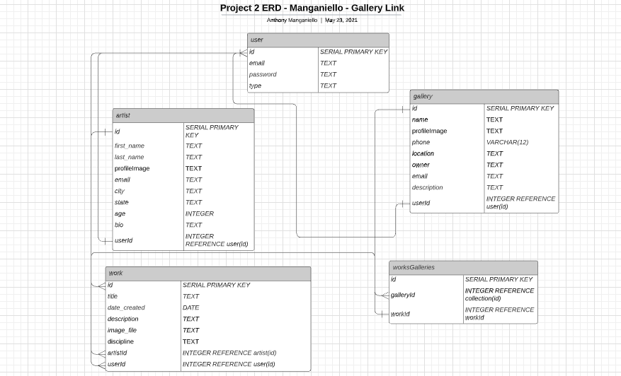

# GalleryLink
## What is it?
GalleryLink is a site for both artists and art galleries. Artists can create accounts to upload their work and galleries can sign up to search for works of art and artists for future shows.
Access via https://gallerylink.herokuapp.com/.

## How does it work?
GalleryLink is a Node.js Express application that uses Sequelize to connect to a Postgres SQL database. The following dependencies were used:

For general app setup:
- "dotenv": "^8.6.0"
- "ejs": "^3.1.6"
- "express": "^4.17.1"
- "express-ejs-layouts": "^2.5.0"
- "express-session": "^1.17.1"
- "method-override": "^3.0.0"
- "morgan": "^1.10.0"

For login auth/encryption:
- "bcrypt": "^5.0.1"
- "connect-flash": "^0.1.1"
- "passport": "^0.4.1"
- "passport-local": "^1.0.0"

For Cloud image storage:
- "cloudinary": "^1.25.1"
- "multer": "^1.4.2"
- "streamifier": "^0.1.1"

For Database management:
- "pg": "^8.6.0"
- "sequelize": "^6.6.2"
- "sequelize-cli": "^6.2.0"

For email API integration:
- "nodemailer": "^6.6.0"
    
### Resources used
For authentication, refer to this Express Authentication template:
[Express Authentication Template](https://github.com/anthonymang/express_authentication)

To integrate email notifications, refer to the NodeMailer tutorial:
[Nodemailer for Node.js](https://www.freecodecamp.org/news/use-nodemailer-to-send-emails-from-your-node-js-server/)

To set up Cloudinary for Cloud Storage:
[Cloudinary Setup](https://git.generalassemb.ly/anthonymanganiello/cloudinary-starter-code)

These processes will require a variety of environment variables, detailed throughout the tutorials. You can find a list of these variables below:
- SECRET_SESSION (user authentication key)
- CL_NAME, CL_APIKEY, CL_SECRET (necessary for Cloudinary integration)
- MAIL_USERNAME, MAIL_PASSWORD, OAUTH_CLIENTID, OAUTH_CLIENT_SECRET, OAUTH_REFRESH_TOKEN (email integration)

### Setting Up Your Database
We are using a Postgres SQL database. We have 4 tables (users, artists, works, galleries) and one join table (worksGalleries). Please refer to the ERD below for the full view of the tables.


  ## Routing
| Route      | Type       | Description   |
| :---        |    :----:   |          ---: |
| /           | GET         | Homepage, search and featured   |
| /profile   | GET        | User's Profile      |
| /auth/signup   | GET        | Show Signup Page      |
| /auth/login   | GET        | Show Login Page      |
| /auth/logout   | GET        | Logs out of account      |
| /auth/login   | POST        | Login request      |
| /auth/signup   | POST        | Create's account from signup page      |
| /artists   | GET        | Show All Artists in Database      |
| /artists/setup   | GET        | Artist Account Setup Page      |
| /artists/:id   | GET        | Specific artist in database      |
| /artists/setup   | PUT        | Edits artist info in database      |
| /galleries   | GET        | All galleries in database      |
| /galleries/setup   | GET        | Set up gallery account      |
| /galleries/:id   | GET        | One Specific      |
| /galleries/favorite/:id   | POST        | Gallery adding artwork to favorites      |
| /galleries/setup   | PUT        |  Edits gallery info in database     |
| /works   | GET        | All works in database      |
| /works/create   | GET        | Create work page      |
| /works/edit/:id   | GET        | Edit work page      |
| /works/:id   | GET        | Specific work      |
| /works/create   | POST        | Adding artwork to database      |
| /works/edit/:idx   | PUT        | Edit work info      |
| /works/remove   | DELETE        | Remove work from Gallery favorite list      |
| /works/delete   | DELETE        | Delete work from Database      |
| /search/results   | GET        | Find Search Results depending on user search      |


## Code Snippets


### CRUD for Works
Create (with Cloudinary Image Upload):
``` js
router.post('/create', isLoggedIn, upload.single('imageUpload'), async (req, res) =>{
    let streamUpload = (req) => {
        // returns new promise object to upload the file to cloudinary
        // if successful, resolve promise, else reject promise
        return new Promise((resolve, reject) => {
            let stream = cloudinary.uploader.upload_stream(
              (error, result) => {
                if (result) {
                  resolve(result);
                } else {
                  reject(error);
                }
              }
            );
            // makes req.file.buffer readable??
           streamifier.createReadStream(req.file.buffer).pipe(stream);
        });
    };
    // writing upload file that uploads once streamUpload is complete
    async function upload(req) {
        try {
        let result = await streamUpload(req);
        const thisArtist = await db.artist.findOne({
            where: {userId: req.user.id}
        })
        const newWork = await thisArtist.createWork({
            imageFile: result.url,
            title: req.body.title,
            yearCreated: req.body.yearCreated,
            description: req.body.description,
            discipline: req.body.discipline,
        })

        const thisUser = await db.user.findOne({
            where: {id: req.user.id}
        })

        const addedWork = await thisUser.addWork(newWork)

        res.redirect(`/artists/${thisArtist.id}`)
        } catch (err){
        console.log(err)
    }
    }
    // invoking upload function
    upload(req);

})
```
Read:
``` js
router.get('/', isLoggedIn, async (req, res) => {
    const allWorks = await db.work.findAll({
        order: [["title", "ASC"]]
    })
    res.render('works/index', {works: allWorks})
})

router.get('/:id', isLoggedIn, async (req, res)=>{
    const thisWork = await db.work.findOne({
        where: {
            id: req.params.id
        },
        include: [db.artist]
    })
    res.render('works/single', {work: thisWork})
})
```

Update:
``` js
router.put('/edit/:idx', isLoggedIn, async (req, res)=>{
    try {
        const thisWork = await db.work.findOne({
            where: {id: req.params.idx}
        })
        const updatedWork = await thisWork.update({
            title: req.body.title,
            yearCreated: req.body.yearCreated,
            description: req.body.description,
            discipline: req.body.discipline,
        })
        res.redirect(`/works/${req.params.idx}`)
    } catch (error) {
        console.log(error)
}})
```

Delete:
``` js
router.delete('/delete', isLoggedIn, async (req, res)=> {
    try {
        const deleted = await db.work.destroy({
            where:{ id: req.body.id }
        })
        res.redirect('/profile')
    } catch (error) {
        console.log(error)   
    }
})
```

### Email Integration
``` js
let transporter = mailer.createTransport({
    service: 'gmail',
    auth: {
      type: 'OAuth2',
      user: process.env.MAIL_USERNAME,
      pass: process.env.MAIL_PASSWORD,
      clientId: process.env.OAUTH_CLIENTID,
      clientSecret: process.env.OAUTH_CLIENT_SECRET,
      refreshToken: process.env.OAUTH_REFRESH_TOKEN
    }
  });


router.post('/favorite/:id', isLoggedIn, async (req,res)=>{
    const thisGallery = await db.gallery.findOne({
        where: {userId: req.user.id}
    })

    const thisWork = await db.work.findOne({
        where: {id: req.params.id},
        include: [db.user]
    })
    thisGallery.addWork(thisWork)
    let emailRecipient = thisWork.user.dataValues.email
    let mailOptions = {
        from: 'YOUR-EMAIL@YOUR-DOMAIN.COM',
        to: emailRecipient,
        subject: 'GalleryLink - Your work was added to favorites!',
        text: `Congrats! ${thisGallery.name} added your piece, ${thisWork.title}, to their collection of favorites.`
    }
    transporter.sendMail(mailOptions, function(err, data) {
        if (err) {
          console.log("Error " + err);
        } else {
          console.log("Email sent successfully");
        }
      });
```

### Search
``` js
router.get('/results', isLoggedIn, async (req,res)=>{
    let results = []
    let target = req.query.target
    if (req.query.search == 'gallery'){
        results = await db.gallery.findAll({
        where: {
            [target]: {
                [Op.iLike]: `%${req.query.query}%` }
        }
    })
    } else if (req.query.search == 'artist'){
        results = await db.artist.findAll({
        where: {
            [target]: {
                [Op.iLike]: `%${req.query.query}%` }
        }
    })
    } else {
        if (target == 'yearCreated') {
            results = await db.work.findAll({
                where:  { 
                    yearCreated: req.query.query}
                    
                })
            } else {
        
        results = await db.work.findAll({
            where:  { 
                [target]: {
                    [Op.iLike]: `%${req.query.query}%`}
                }
            })
        }
    }
    res.render('search/results', {searchResults: results})
  })
  ```

