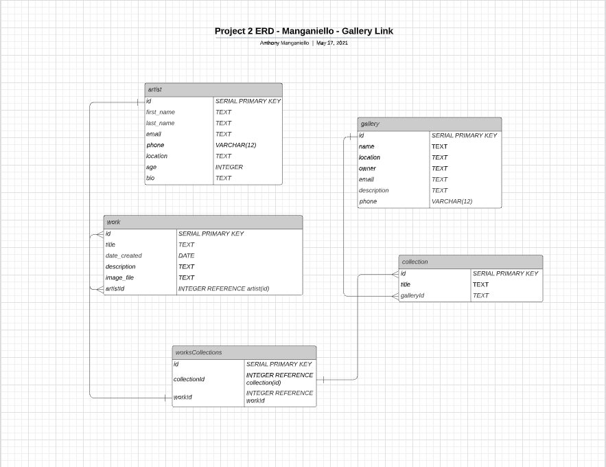

# Proposal
Requirements for the weekend

`1` An application name / concept 
GalleryLink - A platform for artists to upload artwork and for gallery owners/curators to find new art based on search criteria (style, location of artist, etc.)

`2` A repo for your project 2 (built from express_auth template)
https://github.com/anthonymang/gallery-link

`3` Wireframe for your app - (Lucidchart)

`4` An ERD with two models (minimum) > User + 1 Resource (one to many) - (Lucidchart)

`5` Create (3-5) User Stories for the base user experience - ( [Reference](https://revelry.co/resources/development/user-stories-that-dont-suck/) )
- User can create account or log in from landing page to become members.
- Upon login, user (artist) can add art pieces to profile to be found by gallery hosts.
- Upon login, user (gallery) can add show/collection to profile.
- User (gallery) can search for art/artists to add to their collections/future shows.
- User (gallery) can add art piece to collection to plan for show.
- User (artist) can search for galleries/collections to submit their work for consideration.

`6` Resource's Restful Routing table ( [Readme](https://romebell.gitbook.io/sei-412/node-express/00readme-1/01intro-to-express/00readme#restful-routing) )

#### /
- Sign up or log in

#### /search
- search for artists/galleries/shows

#### /artists
- Lists all artists 

#### /artists/:id
- pulls up individual artist - lists details, works

#### /artists/:id/:work
- Displays one specific work of art

#### /artists/:id/create
- Form to upload work of art

#### /artists/register
- Form to register as artist for the site

#### /gallery
- Lists all galleries 

#### /gallery/:id
- pulls up individual gallery - lists details, collections

#### /gallery/register
- Form to register as gallery for the site.

#### /gallery/:collection
- Shows one specific collection from a gallery

#### /gallery/:collection/create
- Form to create a new collection

`7` Find API and test to see if you can get data ( *be able to print data in the console using Axios, Node-Fetch, and/or Postman* )